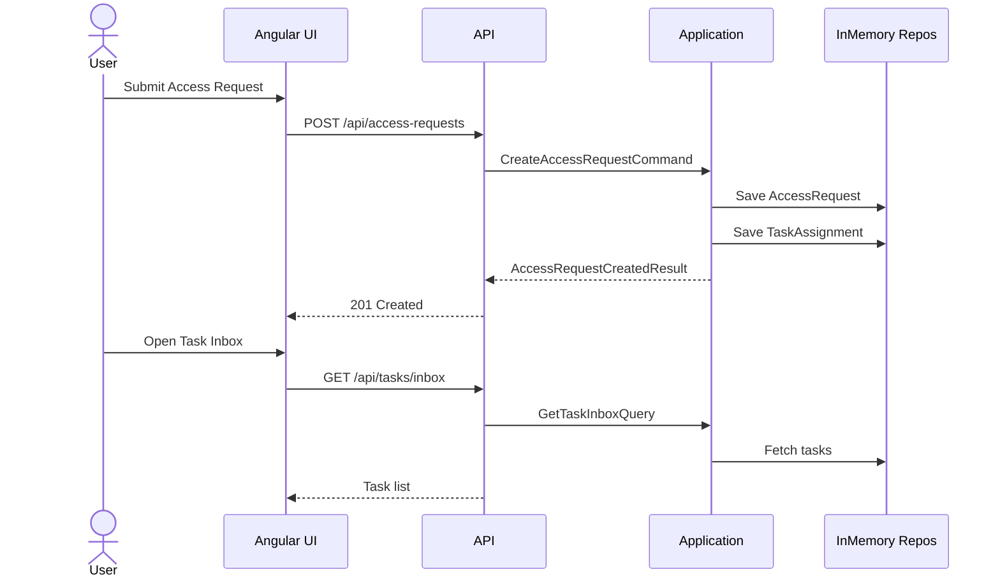

# Feature 1: Access Request Submission + Task Inbox

## Goal
Allow a user to submit an access request and surface it as a task in the Security inbox.

## User Journey
1. User fills out Access Request form.
2. System creates an access request and a Security task.
3. Security reviews the task in the inbox.

## API Contracts
- POST `/api/access-requests`
  - Request: tenantId, requesterName, requesterEmail, systemName, accessLevel, reason, managerName
  - Response: requestId, taskId, status, createdAtUtc
- GET `/api/tasks/inbox?tenantId=...&assigneeRole=...`
  - Response: list of tasks sorted by dueAtUtc

## Domain Model
- AccessRequest
- TaskAssignment

## Sequence Diagram

## UI Notes
- Access Request form with validation and success state.
- Task Inbox with role filter, loading state, and empty state.
- Screenshot
  

## Non-Goals
- Approvals, rejections, and audit trail (Feature 2).
- SLA enforcement and escalation (Feature 4).
